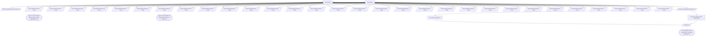

# Analysis graph

Generated 2026-11-14T23:08:14Z by whatran.py/0.4.0. Main path only; rejected branches and unlinked executions are kept in `graph.json`.

```mermaid
flowchart TD
  n0[/"AZTEC_translational_biomarkers.md"/]
  n1[/"knit-unnamed-chunk-10-1.png"/]
  n2[/"knit-unnamed-chunk-11-1.png"/]
  n3[/"knit-unnamed-chunk-12-1.png"/]
  n4[/"knit-unnamed-chunk-13-1.png"/]
  n5[/"knit-unnamed-chunk-14-1.png"/]
  n6[/"knit-unnamed-chunk-15-1.png"/]
  n7[/"knit-unnamed-chunk-16-1.png"/]
  n8[/"knit-unnamed-chunk-17-1.png"/]
  n9[/"knit-unnamed-chunk-18-1.png"/]
  n10[/"knit-unnamed-chunk-19-1.png"/]
  n11[/"knit-unnamed-chunk-2-1.png"/]
  n12[/"knit-unnamed-chunk-20-1.png"/]
  n13[/"knit-unnamed-chunk-21-1.png"/]
  n14[/"knit-unnamed-chunk-22-1.png"/]
  n15[/"knit-unnamed-chunk-23-1.png"/]
  n16[/"knit-unnamed-chunk-24-1.png"/]
  n17[/"knit-unnamed-chunk-25-1.png"/]
  n18[/"knit-unnamed-chunk-26-1.png"/]
  n19[/"knit-unnamed-chunk-27-1.png"/]
  n20[/"knit-unnamed-chunk-28-1.png"/]
  n21[/"knit-unnamed-chunk-29-1.png"/]
  n22[/"knit-unnamed-chunk-3-1.png"/]
  n23[/"knit-unnamed-chunk-30-1.png"/]
  n24[/"knit-unnamed-chunk-31-1.png"/]
  n25[/"knit-unnamed-chunk-4-1.png"/]
  n26[/"knit-unnamed-chunk-5-1.png"/]
  n27[/"knit-unnamed-chunk-6-1.png"/]
  n28[/"knit-unnamed-chunk-7-1.png"/]
  n29[/"knit-unnamed-chunk-8-1.png"/]
  n30[/"knit-unnamed-chunk-9-1.png"/]
  n31["Run Rscript"]
  n32(["Figure 3, the TILs ROC and the logistic model reproduce exac"])
  n33(["Figure 4 and S5 differ: the deposited data give 42 Cycle 1 p"])
  n34[/"AZTEC_translational_biomarkers.md"/]
  n35["Run Rscript"]
  n36[/"pvalues.csv"/]
  n37["Run extract_pvalues.py"]
  n38["Extract p-values from the knitted tables"]
  n39(["The extracted p-values show Figure 3 matching the authors' r"])
  n31 --> n0
  n31 --> n1
  n31 --> n2
  n31 --> n3
  n31 --> n4
  n31 --> n5
  n31 --> n6
  n31 --> n7
  n31 --> n8
  n31 --> n9
  n31 --> n10
  n31 --> n11
  n31 --> n12
  n31 --> n13
  n31 --> n14
  n31 --> n15
  n31 --> n16
  n31 --> n17
  n31 --> n18
  n31 --> n19
  n31 --> n20
  n31 --> n21
  n31 --> n22
  n31 --> n23
  n31 --> n24
  n31 --> n25
  n31 --> n26
  n31 --> n27
  n31 --> n28
  n31 --> n29
  n31 --> n30
  n35 --> n34
  n35 --> n1
  n35 --> n2
  n35 --> n3
  n35 --> n4
  n35 --> n5
  n35 --> n6
  n35 --> n7
  n35 --> n8
  n35 --> n9
  n35 --> n10
  n35 --> n11
  n35 --> n12
  n35 --> n13
  n35 --> n14
  n35 --> n15
  n35 --> n16
  n35 --> n17
  n35 --> n18
  n35 --> n19
  n35 --> n20
  n35 --> n21
  n35 --> n22
  n35 --> n23
  n35 --> n24
  n35 --> n25
  n35 --> n26
  n35 --> n27
  n35 --> n28
  n35 --> n29
  n35 --> n30
  n34 --> n37
  n37 --> n36
  n34 --> n38
  n38 --> n36
  n1 -.-> n32
  n7 -.-> n33
  n36 -.-> n39
```
